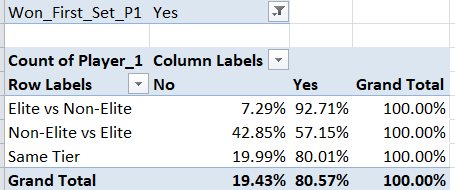

Project Overview: 

This project analyzes how often do male tennis players win a match after winning or losing the first set, and whether this probability differs between elite and non-elite players. A common narrative in tennis is that elite players are, amongst other qualities, better at recovering from setbacks. This project explores that idea quantitatively by examining match outcomes based on first-set results and ranking gaps between players.

The definition of an elite can be debated (especially coming off of the two decade long Big 3 Era in which other Top 10 players were fighting for crumbs, followed by Alcaraz-Sinner winning 9 consecutive majors), however for this project elite players are defined as players ranked inside the Top 10 at the time of the match. 

Data used:

ATP match level dataset (2000-2025)
Over 66,000 ATP Tour matches
Qualifying matches excluded
Walkovers and forfeits removed

Tools Used
- Microsoft Excel (data cleaning, feature engineering, pivot tables)
- The full Excel analysis file used in this project can be found in the repository as [`atp_first_set_analysis.xlsx`](atp_first_set_analysis.xlsx).

Key variables used:

Player rankings at match date
First set winner
Match winner

Methodology:

The analysis was done in Excel using the following steps>

Imported all ATP-Tour level matches from 2000-2025
Filtered out walkovers and forfeits 
Classified matches into four categories:
Elite vs Non-Elite
Non-Elite vs Elite
Elite vs Elite 
Non-Elite vs Non-Elite
Created binary valuables including:
Whether Player 1 won the first set
Whether Player 1 won the match
Used pivot tables to calculate win percentages based on
Player tier
First set outcome

Key results: 

*Elite vs Non-Elite Matches*

Elite vs Non-Elite (Player 1 = Elite): 
Winning the first set resulted in ∼93% match win rate 
Losing the first set still resulted in a ∼43% match win rate
Same-Tier matches (Elite vs Elite or Non-Elite vs Non-Elite), winning the first set resulted in a ∼80% match win rate

Interpretation and Insights:

As perceived, Elite players demonstrate a significantly stronger comeback ability when facing Non-Elite players. When Player 1 lost the first set, was elite and played a non-elite player, he recovered noticeably better than in a same tier match (won 43% compared to 20%) and significantly better than non-elite players vs elite players (43% to 7%).
What is also noticeable is the importance of the first set in a same tier match. Elite players winning roughly 13/14 times vs non-elites after winning the first set was an expected outcome, however winning the first set results in winning the match in 4 out of 5 same tier matches, which shows the significance of it. 
What is also important to notice is the comeback ability of the elites, winning 3/7 matches after being down a set vs non-elites, which is an extraordinary number, compared to a same tier match. Highlights the importance of ranking gaps.

How to Reproduce
1. Open the Excel file included in this repository (atp_first_set_analysis.xlsx)
2. Navigate to the pivot table sheets
3. Use filters to explore match outcomes by:
   - Player tier (Elite vs Non-Elite)
   - First set result

Limitations:

No distinction between playing surfaces nor Best-of-3 and Best-of-5 match formats. 
Possible implications: 
A hypothesis can be made that there is more room for a comeback in a BO5 match, therefore an elite player’s comeback percentage after losing the first set could be even higher.
When it comes to surfaces, clay is an especially interesting one, because the ATP rankings usually do not reflect well on which players are so called “clay specialists”, as they could often be ranked outside of the top 10, therefore betting odds could be a better metric to use here. A similar thought process can be used for grass courts too, however one would think a better analysis for grass would be something related to serving - the likelihood of an in-set comeback after being down by a break on grass.
Future improvements:
Replicate the analysis using SQL
Add surface-specific breakdowns
Separate Best-of-3 and Best-of-5 matches
Explore alternative definitions of “elite” (e.g. Top 5, Big 3, betting odds favorites, surface specialists, etc..)
